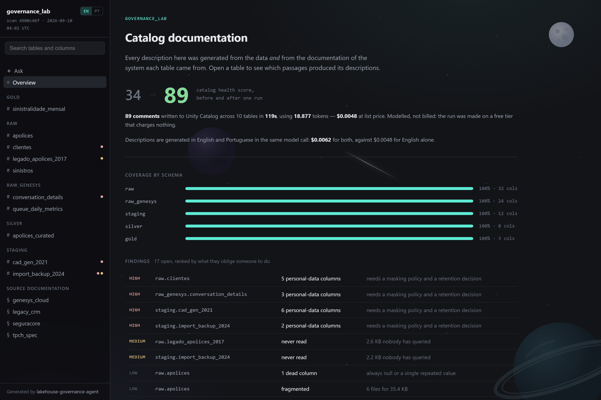
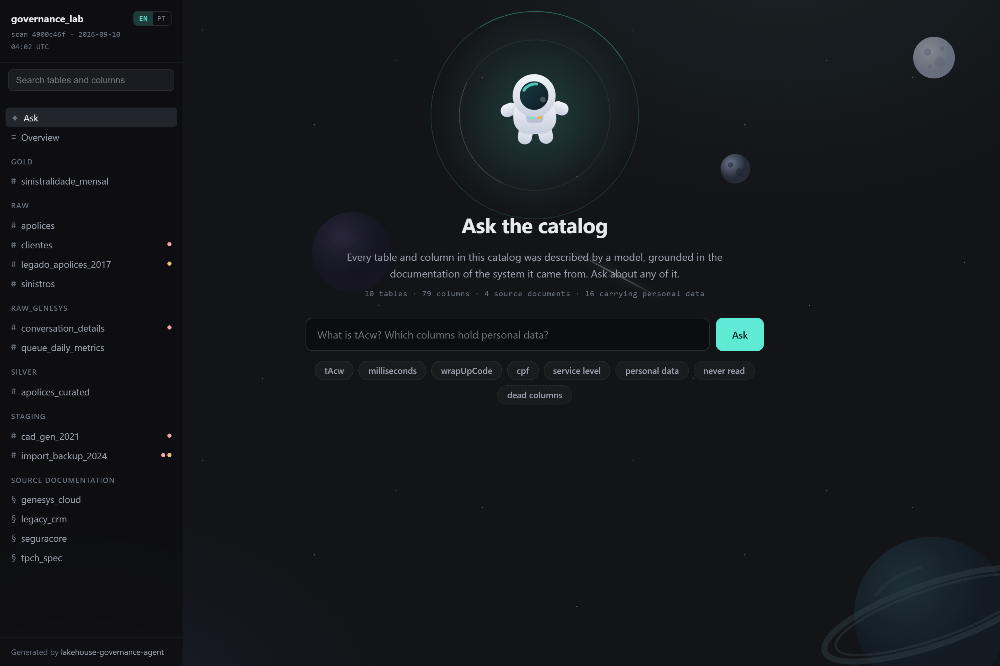
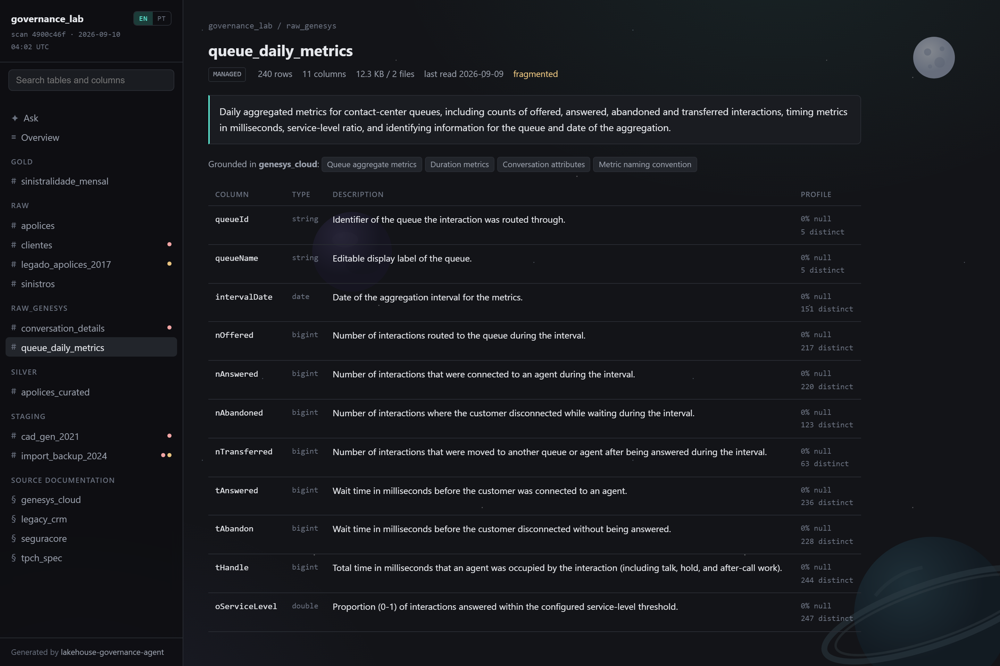
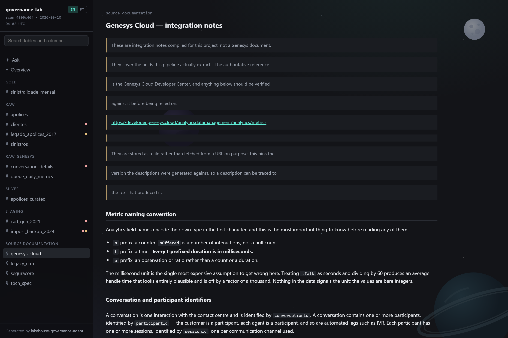
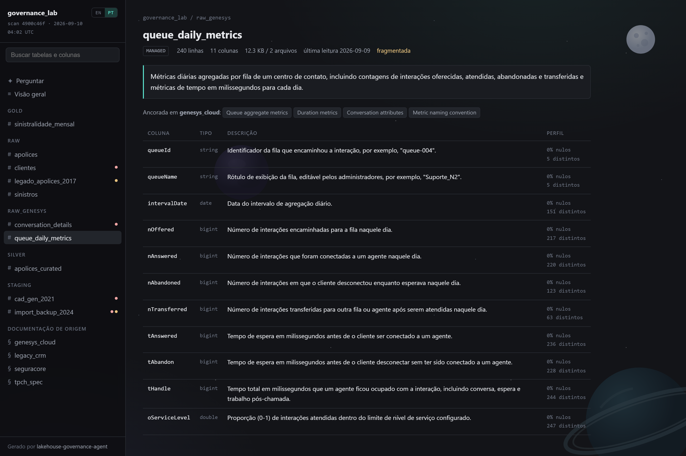

# Lakehouse Governance Agent

A governance audit agent for **Databricks Unity Catalog**. It crawls a catalog,
profiles every column, finds what is undocumented, unclassified, abandoned or
broken, and writes the documentation back — grounded in the documentation of the
system the data came from.

It runs on Databricks Free Edition, against a SQL Warehouse, with no cluster.

[](https://github.com/DudzTheBoy/lakehouse-governance-agent/actions/workflows/tests.yml)
[](LICENSE)

**[Browse the documented catalog &rarr;](https://dudztheboy.github.io/lakehouse-governance-agent/)**

[](https://dudztheboy.github.io/lakehouse-governance-agent/)

---

## Results

One run against a 10-table catalog: 79 columns, four medallion layers, two source
systems.

| | Before | After |
|---|---|---|
| **Catalog health score** | 34/100 | **89/100** |
| Documented columns | 0 of 79 | **79 of 79** |
| Personal-data columns classified | 0 of 10 | **10 of 10** |

89 comments written to Unity Catalog in **118 seconds**, using 18,877 tokens.
At `openai/gpt-oss-120b` list prices that is **$0.0048** — about **$0.00005 per
documented column**.

That figure is modelled, not billed. The runs were made on a free tier that charges
nothing, so it is what the work *would* cost, and the repo says so rather than
quoting a number it did not pay.

The score does not reach 100 because the remaining findings are not documentation
problems. Two tables have genuinely never been read, five columns are dead, six are
fragmented. Those need a human decision, and the agent does not pretend otherwise.

---

## Why this exists when Databricks already generates comments with AI

It does, and that feature is good. This is not a worse copy of it.

Two differences, one of which is structural.

**It is an audit, not a documentation tool.** Documentation is one of five findings.
The others are unclassified personal data, abandoned tables, dead columns and Delta
hygiene.

**It reads the documentation of the source system.** The native feature sees the
data. The data is `47382`. Nothing inside it says whether that is seconds or
milliseconds, and no amount of profiling recovers the answer — the information is
not there to recover. The vendor's documentation has it.

Run against Genesys Cloud tables with no source documentation, the agent described
`tAbandon` and `tHandle` as **seconds**. They are milliseconds. An average handle
time computed from that description is wrong by a factor of a thousand and looks
entirely reasonable. Given the Genesys field reference, both are correct.

---

## Does the grounding actually work? A test built to be able to fail

The Genesys demonstration above proves less than it appears to, and the repo says so
in the commit that added it: the same hand wrote the documentation, generated the
data and declared the result. **A test that cannot fail proves nothing.**

So the same comparison was run against material neither side authored:
`samples.tpch`, which ships with Databricks, and the
[TPC-H v3.0.1 specification](https://www.tpc.org/tpc_documents_current_versions/pdf/tpc-h_v3.0.1.pdf)
downloaded from tpc.org. 61 columns, 30 million rows.

The honest result was **worse and more useful**. Grounding changed 56 of 61
descriptions, but only about 6 changed *materially* — "changed" counts every reworded
sentence and is close to a meaningless metric. The real wins:

| Column | Without documentation | With documentation |
|---|---|---|
| `o_totalprice` | "Total monetary amount for the order" | "**including tax and discount**, computed from its line items" |
| `p_name` | "Name of the part" | "**Synthetic label** built from five colour and texture words" |
| `*_comment` (4 tables) | "Free-form comment about X" | "**Generated filler text with no semantic meaning**" |

`o_totalprice` is the one that costs money: a consumer who does not know it already
includes tax and discount applies them a second time.

**And it failed on the three columns it should have won on.** `l_returnflag`,
`l_linestatus` and `o_orderstatus` are single letters — `N`, `A`, `R`, `O`, `F`, `P` —
whose derivation rules appear verbatim in the specification. The agent glossed them
as "O for open, F for final" and moved on.

The cause was not retrieval. `meta.llm_suggestions.doc_citations` recorded that the
passage containing the rules **was** retrieved and was in the prompt. The model
preferred a familiar guess about a famous benchmark over the text it was given — a
parametric prior beating supplied context.

The fix was one paragraph of instruction, not more retrieval engineering: the
description must carry the rule the documentation states, and a description that
repeats what a reader already assumed adds nothing. All three recovered:

> `l_returnflag` — Flag set to "R" or "A" at random if L_RECEIPTDATE is on or before
> the current date, otherwise set to "N".

In that same run, the ungrounded pass invented `A` = **"after-sale"**. No such
meaning exists in the specification. Without documentation the model does not
decline to answer; it answers confidently and wrongly. **A catalog full of confident
invented descriptions is worse than an empty one, because nobody audits what looks
finished.**

---

## The portal

A documented catalog nobody can open does not look like a documented catalog. The
agent's output is published as a static site: every table, every column, every
generated description, and the passages of source documentation that produced them.

**[dudztheboy.github.io/lakehouse-governance-agent](https://dudztheboy.github.io/lakehouse-governance-agent/)**

The provenance link is the reason it exists rather than being a dashboard. A reader
can see that `tAbandon` says "milliseconds", click the passage that made it say so,
and land in the Genesys field reference. That is the difference between a description
you trust and one you merely accept.

### Ask the catalog



A search across every generated description and every source document, running in the
browser with no key and no backend. Type `tAcw` and it answers from the description
grounded in the Genesys reference, and names the passage.

What it deliberately does not do is pretend to be an assistant. Keyword search cannot
answer "which columns hold personal data" — no description contains the phrase, they
say CPF, or full name — so that concept is a **filter** over a flag the crawler
recorded, not a synonym table faking comprehension. The footer of the panel says which
is which.

That gap is the argument for the next step: a Databricks Genie Agent connected over
the same descriptions would answer the question as asked. `askLocally()` in
`src/build_site.py` is the single function that call would replace.

| | |
|---|---|
|  |  |

One self-contained HTML file with the data embedded — no build step, no runtime
dependency, no server. It opens from disk, serves from GitHub Pages, or travels as a
single attachment. It is a snapshot, not a live view, and the page says so.

Deliberately **not** a Databricks App: an App sits behind a workspace login, which is
right for an internal tool and useless for anything a stranger should be able to open.

```bash
python src/build_site.py      # -> docs/index.html
```

## Two languages, one model call

Descriptions are produced in English and Brazilian Portuguese in the same response,
not in a second translation pass. The expensive part of the prompt — the profile, the
samples, the retrieved documentation — is identical for both, so asking for both costs
output tokens rather than a second round trip: **$0.0048 to $0.0062, up 29% for twice
the coverage.**



This is not localisation. A catalog in a multinational is read by people who do not
share a language, and a description in a language the reader does not have is a
description they will not check. The Portuguese carries the same facts, including
units and derivation rules, and leaves identifiers alone: `wrapUpCode` stays
`wrapUpCode`, and `F` is not turned into "final".

Unity Catalog holds one `COMMENT` per object, so English is what is written to the
catalog and Portuguese lives in `meta.llm_suggestions` and
`meta.llm_table_descriptions`, where the portal reads it. Storing a language the
catalog cannot hold is the point: the catalog serves one audience, the portal serves
the rest. Source documents are never translated — they are the vendor's words, and
rewriting them would defeat grounding.

## The five findings

| # | Finding | How |
|---|---|---|
| 1 | Undocumented tables and columns | `information_schema`, with `DESCRIBE` fallback |
| 2 | Unclassified personal data | Name patterns + value patterns + model, all three recorded separately |
| 3 | Abandoned tables | No read in 90 days, from `system.query.history` |
| 4 | Dead columns and wrong types | 100% null, single-valued, currency stored as text |
| 5 | Delta hygiene | Never optimised, small-file fragmentation, ownership |

On finding #5: what you see in the sample report is fragmentation only. The
ownership check is implemented and finds nothing, because every table in this
workspace has an owner set. That is a real result rather than a gap, but it is worth
saying out loud — a finding that never fires reads like a finding that does not
exist, and on a workspace with service-principal-created tables it would fire.

Fragmentation itself over-reports at demo scale: a 36 KB table across 6 files is
technically fragmented and worth nobody's time. The report carries `size_bytes` so
findings can be ranked by what they actually cost rather than counted.

---

## Design decisions

### The auditor was corrupting its own evidence

Detecting an abandoned table means asking when it was last read. But profiling a
table *is* a read, and it lands in the same log. Left alone, the tool reports every
table it has ever scanned as actively used, and finding #3 is worthless.

Three attempts, in the git history:

1. **Subtract each scan's time window from `system.access.audit`.** Failed: Unity
   Catalog stamps audit events asynchronously, so a scan that ran 19:32:59–19:33:25
   produced audit rows stamped 19:34:32 onward — outside its own window, read back
   as user traffic.
2. **Pad the window by 20 minutes.** Failed differently: it swallowed a simulated
   analyst session that ran four minutes after a scan. Every scan was creating a
   40-minute blind spot.
3. **Mark the statements.** Every query against user data carries a marker comment,
   and last-read comes from `system.query.history` excluding statements that carry
   it. Time was never the right key; identity is.

Verified: eight tables read by a simulated analyst, both intentional orphans still
reporting never read, in the same run that profiled all ten.

Known limitation: matching is by qualified name, so a session that sets the catalog
and then queries a bare table name is not counted.

### Personal data values never reach the model

Pattern detection runs at collection time. Sample values for flagged columns are
redacted before they are written to the inventory, and the prompt for those columns
carries name, type and statistics only.

It works: the model identified `cpf` as the Brazilian taxpayer registry from the
column name, having never seen a value. The values were not carrying the meaning.

**The guarantee is only as strong as the detector.** A column the patterns miss will
have its values sent — which is exactly what happened to `f_01`, a column of real-
looking names behind a meaningless name. That is a documented limitation, not a
solved problem.

### Patterns and the model are compared, not blended

Every suggestion records the pattern verdict and the model verdict side by side.
They are good at different things, and the difference is the interesting part:

- Patterns can **verify**. A CPF check digit either passes or it does not, which is
  how an 11-digit CPF is told apart from an 11-digit mobile number.
- Patterns cannot recognise a person's name. No regex does.
- The model reads meaning, and gets it wrong in language-specific ways: it called a
  Brazilian city column a surname, because `Oliveira do Oeste` is both.

On a catalog with honest column names the two agreed on 47 of 47 columns — the model
added nothing a regex had not already found. It earns its cost on `f_01` and `f_05`,
not on `email`.

### Engine backing tables are excluded

Streaming tables and materialized views are backed by physical `__materialization_*`
tables that mirror them one for one. Auditing those counts every finding twice and
inflates the numbers. They are filtered, and that is a governance decision worth
stating rather than a detail worth hiding.

### information_schema is not always populated

Shared catalogs — including Databricks' own `samples` — expose tables in
`information_schema.tables` and nothing in `information_schema.columns`. A crawler
that trusts it reports those catalogs as having zero columns: a clean-looking result
that is entirely wrong. Falls back to `DESCRIBE`.

---

## How it works

```
src/seed.py             build a controlled catalog with deliberate, documented defects
src/crawler.py          inventory + per-column profile -> meta.table_inventory, meta.column_profile
src/docs_index.py       map tables to source systems, retrieve the relevant passages
src/agent.py            descriptions + PII classification, dry-run by default
src/report.py           consolidated findings -> out/report.md
src/compare_grounding.py  run twice, with and without documentation, and diff
src/simulate_usage.py   analyst traffic, so orphan detection has a contrast
tests/                  the two classifiers that have already been wrong in production
```

`pytest tests` — 60 tests, no warehouse connection needed. They cover the personal-data
classifiers and documentation retrieval, which is where the bugs have actually been:
value sniffing once reported every date and currency column as a phone number, and
writing these tests turned up a live one — `ip_address` was being labelled a postal
address, because `address` matched inside it and was checked first.

Nothing is written to a catalog unless you pass `--apply`. The default prints the
exact SQL it would run.

Retrieval is lexical TF-IDF over heading-delimited chunks, deliberately not vector
based. Column names are literal vendor terminology, so lexical matching hits — and a
lexical hit can name the passage that produced a description, which is what makes a
generated description auditable rather than merely plausible. Every suggestion stores
the system, the passages cited and the terms that matched.

### Connecting your own documentation

Not vendor-specific. Map table patterns to a system in `docs/sources.json`, and put
that system's documentation in `docs/sources/<system>.md`:

```json
{ "match": "raw_genesys.*", "system": "genesys_cloud" }
```

Store the docs as files rather than fetching a URL: it pins the version a description
was generated against, so the description can be traced back to the text that
produced it.

---

## Setup

```bash
python -m venv venv
venv\Scripts\activate
pip install -r requirements.txt

copy .env.example .env      # host, HTTP path, token, Groq key
python src/test_connection.py
```

`test_connection.py` probes every system table the agent depends on and reports each
independently, so a partial failure names exactly what is unavailable.

```bash
python src/seed.py            # build the demo catalog
python src/crawler.py         # inventory and profile
python src/agent.py           # dry run: prints the SQL
python src/agent.py --apply   # writes the comments
python src/report.py          # out/report.md
```

To audit a catalog you cannot write to:

```bash
python src/crawler.py --catalog samples --schema tpch --meta-catalog governance_lab
```

---

## What I would do differently

**Measure material change, not change.** "56 of 61 descriptions changed" is close to
noise, because rewording is what language models do. The metric that matters is how
many changed *meaning*, and counting that by hand does not scale. A second model
judging semantic difference would.

**Test against unfamiliar documentation.** TPC-H is in every model's training data,
which is precisely why the prior beat the retrieved text. A proprietary internal
system the model has never seen is the harder and more realistic case, and it is
untested here.

**Cost estimates for abandoned tables need real billing data.** `system.billing.usage`
on Free Edition stops reporting and shows hundredths of a DBU, so the report models
storage cost from bytes at list price and says so. On a paid workspace the real number
is available and would be better.

**Retrieval will not survive a real vendor documentation set.** Nine chunks of
hand-scoped Markdown is not a thousand pages of Genesys reference. Lexical matching
was the right call at this size and the honest expectation is that it degrades; that
is where embeddings would earn their infrastructure.

**Orphan detection depends on query history retention.** A table last read thirteen
months ago and a table never read are indistinguishable to this tool.
